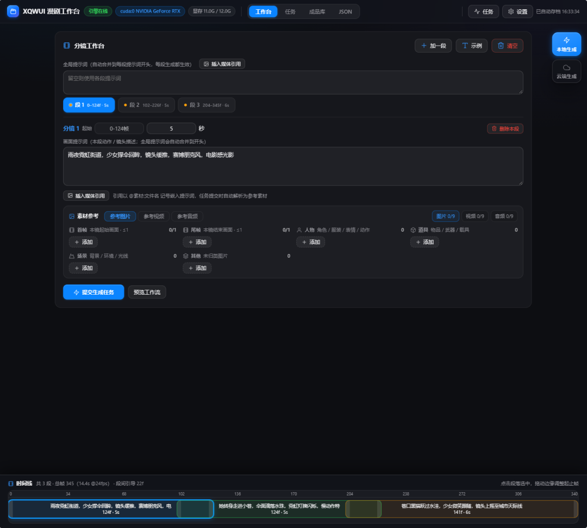

# XQWUI · 独立 AI 视频生成工作台

> 完全独立运行的多段长视频生成系统：**不依赖 ComfyUI 运行时**。
> 自带轻量推理引擎（对外接口遵循 Comfy 后端 API 规范）、任务调度后端、
> 零构建前端工作台。`MiniMax H3` 的 `timeline_data` 时间线规则由代码
> 动态生成，无任何 JSON 模板。

---

## 产品简介



**分镜工作台**：顶部实时显示引擎连接状态与 GPU 显存，左侧分镜编辑区支持逐段配置
画面提示词与素材参考，底部时间轴直观展示各段的帧区间与合法重叠。

- **分镜编辑**：段级起止帧（如 0-124帧 / 5秒）、全片段提示词与段内提示词联动，
  支持 `@素材:文件名` 媒体引用，提交时自动解析归并为参考素材
- **素材参考**：首帧/尾帧、人物（角色/服装/表情/动作）、道具、场景/光线等
  分类标签，逐类添加参考图片/视频/音频
- **时间轴**：总帧数与段间引导一目了然，起止帧可拖拽、自动吸附 `5+17n` 帧网格
- **一键操作**：「提交生成任务」「预览工作流」直达推理链路；
  「本地生成 / 云端生成」双模式切换，参数独立记忆

---

## 系统构成

```
浏览器 ──REST + WebSocket──▶ 应用后端 xqwui ──Comfy 规范 API──▶ 推理引擎 engine
 (web/ 静态页)               (调度/存储/素材/结果)              (图执行器+可插拔计算后端)
```

| 组件 | 入口 | 默认端口 | 职责 |
|---|---|---|---|
| **推理引擎** `engine/` | `python3 -m engine.main` | `8189` | 接收工作流 JSON、执行推理、标准化返回结果、WS 推送进度 |
| **应用后端** `xqwui/` | `python3 -m xqwui.main` | `8900` | 任务调度（创建/暂停/取消/重试）、本地存储、REST API、事件转发 |
| **前端** `web/` | 由应用后端托管 | 同上 | 工作台参数配置、分镜编排、任务中心、结果展示、设置 |

环境依赖：**Python 3.10+**（引擎媒体节点需 `numpy`）、`ffmpeg`（视频组装）。
除 numpy 外全部为标准库实现，无框架、无构建步骤。

---

## 快速开始

```bash
# 1. 启动推理引擎（终端 A）
python3 -m engine.main

# 2. 启动应用后端（终端 B）
python3 -m xqwui.main

# 3. 浏览器打开
#    http://127.0.0.1:8900
```

### 环境变量

| 变量 | 默认 | 说明 |
|---|---|---|
| `ENGINE_HOST` / `ENGINE_PORT` | `0.0.0.0` / `8189` | 引擎监听地址与端口 |
| `ENGINE_DATA` | `data/engine` | 引擎运行时目录（input/output/temp/历史） |
| `ENGINE_BACKEND` | `auto` | 计算后端选择；`auto` 取第一个可用后端，否则精确匹配 `engine/compute/backends/` 下的后端名 |
| `XQWUI_HOST` / `XQWUI_PORT` | `0.0.0.0` / `8900` | 应用后端监听地址与端口 |
| `XQWUI_CONFIG_FILE` | `data/config.json` | 应用后端配置文件路径（CLI `--config` 经此生效） |
| `XQWUI_LOG_LEVEL` | `INFO` | 应用后端日志级别（CLI `--log-level` 经此生效） |

---

## 命令行管理（应用后端）

应用后端提供完整的服务生命周期管理命令，幂等可重复执行：

```bash
python -m xqwui.cli <command> [options]
```

| 命令 | 功能 |
|---|---|
| `start` | 启动服务。默认前台运行（`Ctrl+C` 优雅退出）；`-d` 后台守护运行（日志重定向到 `data/logs/cli-daemon.log`，pid + 健康探针双确认就绪）。已在运行时仅提示并成功退出 |
| `stop` | 优雅停止：先停 HTTP 接收，再释放调度器线程与引擎连接，最后清理 pid 记录（`data/xqwui.pid`）。POSIX 发 `SIGTERM`；Windows 等待宽限期后强制结束（任务状态已落盘）。未运行时仅清理残留记录并成功退出 |
| `restart` | 先 `stop` 再 `start`（沿用 start 参数） |
| `status` | 查询运行状态：pid 存活 + HTTP 健康探针双重确认，输出 pid / 地址 / 运行时长 / 引擎在线状态 |

**参数列表**

| 参数 | 适用命令 | 说明 |
|---|---|---|
| `-H, --host` | start / restart | 监听地址（默认取配置） |
| `-p, --port` | start / restart | 监听端口（默认取配置） |
| `-c, --config` | start / restart | 配置文件路径（默认 `data/config.json`） |
| `-l, --log-level` | start / restart | 日志级别：`DEBUG / INFO / WARNING / ERROR` |
| `-d, --daemon` | start / restart | 后台守护运行 |
| `--wait 秒` | start / restart | 后台模式等待就绪超时（默认 20） |
| `--timeout 秒` | stop / restart | 优雅退出宽限期（默认 10，超时强制） |

**使用示例**

```bash
python -m xqwui.cli start                      # 前台启动
python -m xqwui.cli start -d                   # 后台守护启动
python -m xqwui.cli start -d -p 9000 -l DEBUG  # 指定端口与日志级别
python -m xqwui.cli status                     # 查询状态
python -m xqwui.cli stop                       # 停止服务
python -m xqwui.cli restart -d -p 9000         # 重启为后台模式
```

**退出码**：`0` 成功；`1` 操作失败；`2` 参数错误；`3` status 时服务未运行（便于脚本判断）。

> 推理引擎（`engine/`）仍用 `python3 -m engine.main` 前台启动；
> `python3 -m xqwui.main` 前台启动方式继续可用，与 CLI 等价。

---

## 能力一览

- **可视化分镜编排**：段增删、拖拽调长，自动吸附 `5+17n` 帧网格与合法重叠集合；参考图逐段配置，支持沿 inherit 链继承；起止帧在时间轴拖拽调整，整数秒位置实时显示
- **提示词媒体引用**：画面提示词可插入 `@素材:文件名` 记号引用图片 / 音频 / 视频（素材选择或本机路径），提交时自动解析归并为参考素材，路径素材自动导入素材库
- **代码化工作流**：`GraphBuilder` DSL 动态生成全部工作流结构，改逻辑即改代码，无模板文件
- **任务调度**：提交 / 暂停 / 恢复 / 取消 / 重试 / 删除，任务状态落盘 `data/tasks/*.json`，重启后自动恢复
- **实时推送**：引擎事件经应用后端 WebSocket 转发，任务卡片与进度实时刷新
- **纯本地存储**：所有素材与生成内容存本地文件系统；素材库 / 成品库路径可在设置中自定义（留空用默认 `data/storage/`）
- **生成模式切换**：界面右侧「本地生成 / 云端生成」两枚独立按钮，点击切换模式并自动弹出对应参数配置弹窗；弹窗内含引擎连接与完整生成参数（画面/模型/采样/二采/输出），模型清单按模式实时获取（云端走云端引擎地址）；激活按钮高亮，各模式参数独立记忆（来回切换不丢失）；「测试连接」一键验证并显示引擎版本、GPU 与延迟，失败给明确错误
- **可插拔计算后端**：`engine/compute/backends/` 下实现 `ComputeBackend`
  接口即可接入真实推理栈；未部署时内置 `null` 后端给出明确错误，链路可演示

---

## 项目结构

```
Comfy-XQWUI/
├── engine/                  # 轻量推理引擎（Comfy 后端 API 规范）
│   ├── main.py / api.py       入口与 REST/WS 路由
│   ├── executor.py            图执行器（拓扑执行 / 事件流）
│   ├── queueman.py            队列与历史
│   ├── registry.py            节点注册表
│   ├── nodes/                 内置节点（媒体IO / 视频 / H3 计算节点）
│   └── compute/               可插拔计算后端（base / loader / backends/null）
├── xqwui/                   # 应用后端
│   ├── main.py / config.py    入口与配置
│   ├── api/                   REST 路由（任务/系统/素材/结果/存储/预设）
│   ├── scheduler/             任务状态机与调度管理
│   ├── workflow/              代码化工作流构建（DSL + 时间线规则 + H3 生成器）
│   ├── storage/               本地文件系统存储（素材库/成品库路径可配置 + 路由器）
│   └── engine_client.py       引擎客户端（HTTP + WS 事件订阅）
├── web/                     # 前端（ES modules，零构建）
│   ├── index.html
│   ├── css/  base / workbench / tasks / results
│   └── js/   core / api / ws / ui / timeline / media / segments /
│              workbench / tasks / results / settings / floatpanel / init
├── shared/                  # 公共基座（httpd 路由、RFC6455 WebSocket、工具）
├── data/                    # 运行时数据（tasks / storage / engine / presets）
├── models/                  # 模型库（默认扫描目录之一）
└── docs/                      技术架构.md（架构/接口/数据流转）+ screenshots/（界面截图）
```

---

## 文档

| 文档 | 内容 |
|---|---|
| [技术架构](docs/技术架构.md) | 三层架构、REST/WS 接口清单、任务状态机、数据流转、错误处理 |
---

## 许可

**CC BY-NC-SA 4.0**（署名—非商业性使用—相同方式共享），
版权所有 (c) 2026 comfy-小青蛙UI，详见 [LICENSE](LICENSE)。

| | 允许 | 条件 |
|---|---|---|
| 学习 / 运行 / 自用 | ✅ | — |
| 修改与再分发 | ✅ | 保留署名与本协议声明，并注明修改 |
| **任何商业用途** | ❌ | 需另行获得作者书面授权 |
| 分发修改版本 | ✅ | 必须同样采用 CC BY-NC-SA 4.0（SA 传染） |

禁止的范围包括但不限于：以盈利为目的对外提供服务、集成进商业产品、商业
交付或用于商业内容生产。第三方依赖（Python / numpy / ffmpeg 等）仍各自
遵循原有许可。
